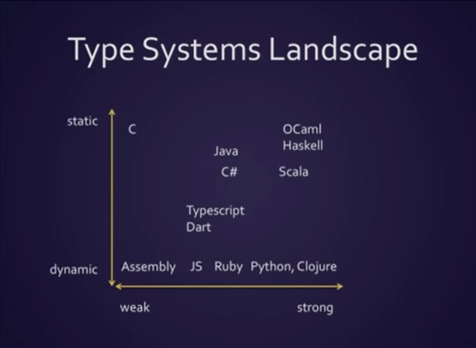
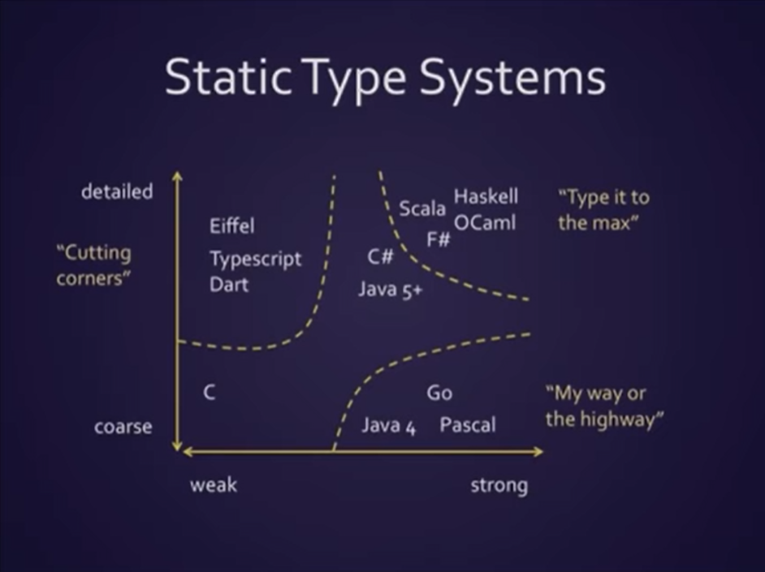
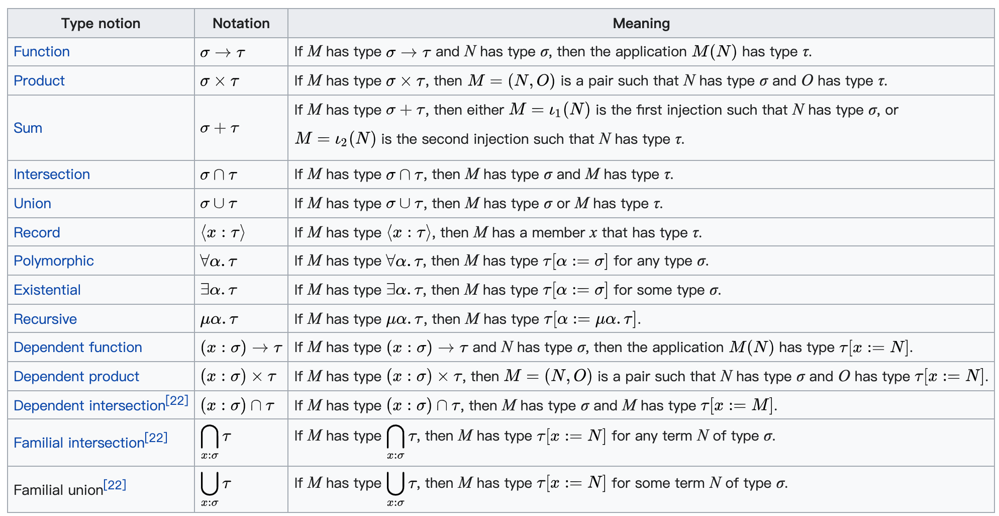

# 类型系统


## 类型由来

从历史上看，数学，逻辑学，集合论，类型论。

Bertrand Russell（罗素）& [ZFC](https://en.wikipedia.org/wiki/Zermelo%E2%80%93Fraenkel_set_theory)

- 每个术语都应该被分配一个类型。它通常用冒号表示：
2 : nat

- 如果我们想定义一个函数，我们将定义它操作的类型：例如
times2 : nat → nat

> f : X → Y read as: f is a function from X (domain) to Y (codomain).

- 可以使用明确定义的规则转换术语：例如
2 + 2 ↠ 4 和 2 + 2 = 4, 他们的类型是相同的

1940年，Alonzo Church将类型理论与他自己的`lambda`演算相结合，创建了[简单类型的lambda演算](https://en.wikipedia.org/wiki/Simply_typed_lambda_calculus)。从那时起，出现了更高级的类型理论。


## 类型直觉

类型论与集合论并行存在：

1. 我们说值a属于一个类型A：`(a : A)`
2. 我们也可以说值a属于一个集合A：`(a ∈ A).`
3. 我们也可以说类型A是类型B的父类型，类型B是类型C的父类型：`C ⊂ B ⊂ A`
4. 我们也可以说t同时属于类型X和Y：`t ∈ X ∩ Y`

如果我们定义了一组除自身之外的所有值，在类型理论中，我们将其称为顶级类型：包含所有其他类型（是其超类型）的类型。类似地，空集将有一个底部类型形式的对应物。为了更容易记住，将类型想象成一个层次结构，其中更通用（较少限制）的类型在上面，更具体（有更多要求）在下面。然后没有要求的类型将位于顶部并包含所有值，而底部的类型及其上方所有类型的要求（必须是矛盾的）将是空的

> top type, bottom type


## In Programming Language

**划重点**

- 对于计算机 - 类型描述了如何解释内存中的位模式

- 对于编译器或解释器 - 类型有助于确保在程序运行时一致地解释位模式

- 对于程序员 - 用户体验

  

*类型系统其实就是，对类型进行定义、检查和处理的系统。*

作为一门语言的核心要素，类型系统很大程度上塑造了语言的用户体验以及程序的安全性。因为，在机器码的世界中，没有类型而言，指令仅仅和立即数或者内存打交道，内存中存放的数据都是字节流。

所以，可以说类型系统完全是一种工具，编译器在编译时对数据做静态检查，或者语言在运行时对数据做动态检查的时候，来保证某个操作处理的数据是开发者期望的数据类型。

*Type Systems Landscape*





- 强类型、弱类型：强调开发体验，定义后能否被隐式转换

- 静态类型、动态类型：强调在哪个期间做类型检查（编译期间/运行期间、编译器/解释器）

## Named Type/Nominal typing - class/interface/trait/object/enum

in scala

```scala
object Person {}
trait Service { def sleep = ??? }
```

in typescript

```typescript
class Person {}
interface Service { peaceful?: boolean; }
```

## Parameterized Type

顾名思义：参数化类型，简单讲，它可以是泛型。

in scala

```scala
sealed abstract List[+A]
```

in java

```java
public <T> List<T> fromArrayToList(T[] a) {   
    return Arrays.stream(a).collect(Collectors.toList());
}
```

in rust

```rust
fn largest<T>(list: &[T]) -> T {}
```

in ts

```typescript
function identity<Type>(arg: Type): Type {
  return arg;
}
```

泛型概念较多，型变、不变、协变、逆变; use-site、declaration-site等等，就不在这里具体展开了

具体语言实现方式各有千秋：静态分派，动态分派，类型擦除

## Existential Type

in scala

```scala
sealed trait Existential {
   type Inner
   val value: Inner
}

case class PrepareExistential[A](value: A) extends Existential {
  type Inner = A
}

PrepareExistential("SomeText"): Existential
PrepareExistential(1: Int): Existential
PrepareExistential(User): Existential
```

in Haskell

```has
```

in typescript

```typescript
```

in rust

```rust
```


## Union/Intersection Type

集合论：A ∩ B = {} / A ∪ B = { a, b }

in scala - `|` and `&`

```scala
case class UserName(name: String)
case class Password(hash: Hash)
// Union `|`
def help(id: UserName | Password) = ???

// Intersection `&`
trait Resettable:
  def reset(): Unit

trait Growable[T]:
  def add(t: T): Unit

def f(x: Resettable & Growable[String]) =
  x.reset()
  x.add("first")
```

in ts `|` and `&`

```typescript
// Union
function padLeft(value: string, padding: string | number) {
  // ...
}

// Intersection
type C = A & B
```

## Higher-Kinded Type（HKT）

译过来就是：更高级种类的类型！在FP世界推崇、惯用，在OO语言非常少见，常用来构建基础库啥的。我的理解入门：类型构造器化为实际类型

Higher: (order)

```scala
// 高阶函数(higher-ordered function)
(a: Int) => (b: Int) => a + b
```

Kind: `*`, `* -> *`, `* -> * -> *`

Type: String, Int, etc.

String是`*`, Int => Int是`*`, F[A]是`* -> *`

in haskell

```haskell
class Functor (f :: * -> *) where
  fmap :: (a -> b) -> f a -> f b
...
```

in scala

```scala
trait Functor[F[_]] {
  def map[A, B](f: A => B): F[A] => F[B]
}
```

in typescript

```typescript
interface HKT<F, A> {
  readonly _F: F;
  readonly _A: A;
}

export interface Functor<F> {
  map<A, B>(f: (a: A) => B, fa: HKT<F, A>): HKT<F, B>
}
```

## ADTs(Algebraic data types)代数数据类型

函数式语言的概念，名字很高大上，其实含义很简单，是使用`ands`和`ors`表示数据的惯用方法。

术语是`product/cartesian product`(ands)和`sum/coproduct`(ors)

举个例子

- 一个形状是长方形**or**圆形
- 长方形有宽**and**高
- 圆形有半径

in scala

```scala
sealed trait Shape
case class Rectangle(width: Double, height: Double) extends Shape
case class Circle(radius: Double) extends Shape

val rect: Shape = Rectangle(3.0, 4.0)
val circ: Shape = Circle(1.0)

def area(shape: Shape): Double =
  shape match {
    case Rectangle(w, h) => w * h
    case Circle(r)       => math.Pi * r * r
  }

area(rect)
// res1: Double = 12.0
area(circ)
// res2: Double = 3.141592653589793
```

in haskell

```haskell
data Shape s = Rectangle | Circle deriving (Show)

main = let
    shape = Rectangle
    in print shape
```

in typescript

```typescript
type Sahpe<T> = Rectangle | Circle<T>;
```


| 概念              | 理论意义   | 具体                                                         |
| ----------------- | ---------- | ------------------------------------------------------------ |
| Top / Bottom Type | 满足集合论 | Any, Object, null, undefined, Nothing, Null, Unit..          |
| Duck typing       | 弱类型世界 | Python, Javascript……                                         |
| Type Safety       | 强类型世界 | 从内存的角度看，类型安全是指代码，只能按照被允许的方法，访问它被授权访问的内存。 |
| Type Erasure      | 泛型背后   | Java，C#，C++                                                |


## refined sample


## 附

[Type theory](https://plato.stanford.edu/entries/type-theory/)

[Set Theory](https://plato.stanford.edu/entries/set-theory/)



[Rust/Haskell: Higher-Kinded Types (HKT)](https://gist.github.com/CMCDragonkai/a5638f50c87d49f815b8)